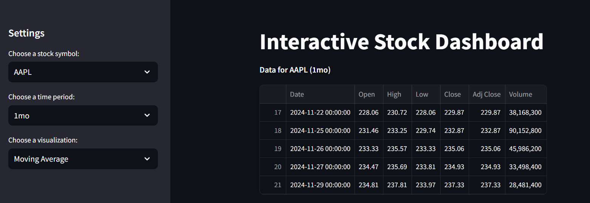
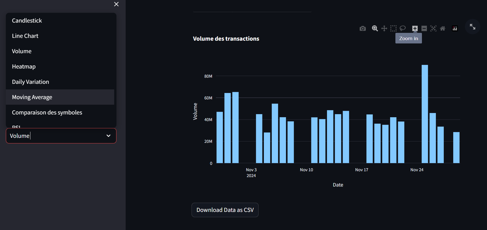
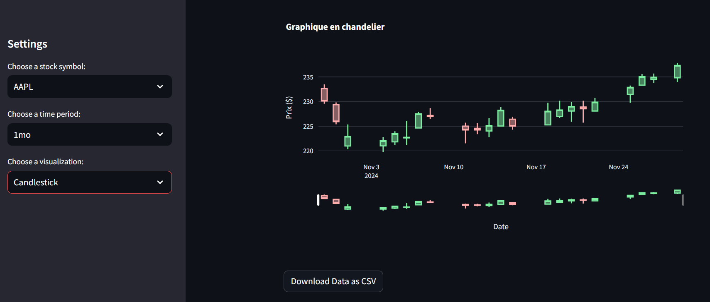
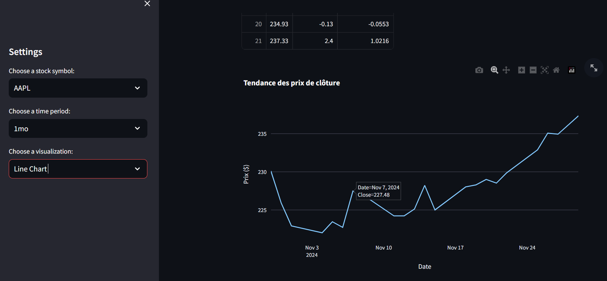

# Stock Dashboard 📈

This project is an interactive stock data visualization app built with **Streamlit** and **Plotly**, designed to explore and analyze stock market performance.

---

## Features 🔧

1. **Stock Data Display:**
   - Retrieve stock data for user-selected symbols using the `yfinance` API.
   - Display raw data and export it as a CSV file.

2. **Interactive Visualizations:**
   - **Candlestick Chart:** Analyze daily price movements.
   - **Line Chart:** Track price trends over time.
   - **Volume Chart:** Compare trading volumes.
   - **Heatmap:** Identify price fluctuations visually.
   - **Daily Variation:** Analyze day-to-day price differences.
   - **Moving Averages:** Track trends over different periods.
   - **Symbol Comparison:** Compare multiple stocks side by side.
   - **RSI (Relative Strength Index):** Evaluate overbought/oversold trends.
   - **Price Distribution:** Visualize price distribution.
   - **Correlation Matrix:** Analyze relationships between multiple stocks.

3. **User Options:**
   - Select stock symbols from a dropdown menu.
   - Choose a period for analysis (1 month, 3 months, etc.).
   - Compare multiple symbols interactively.

4. **Data Export:**
   - Download raw data as a CSV file.

## Screenshots

Here are some screenshots of the application:










---

## Installation 🚀

### Prerequisites
- **Python 3.8+**
- **pip** (Python package manager)

### Installation Steps

1. Clone this repository:
   ```bash
   git clone https://github.com/your_username/stock-dashboard.git
   cd stock-dashboard

2. Install the dependencies:
pip install -r requirements.txt

3. Run the Streamlit app:
streamlit run app.py

4. Open the app in your browser at:
http://localhost:8501

